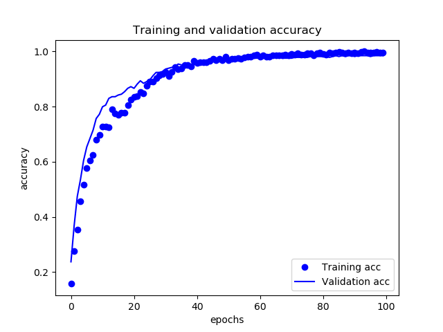
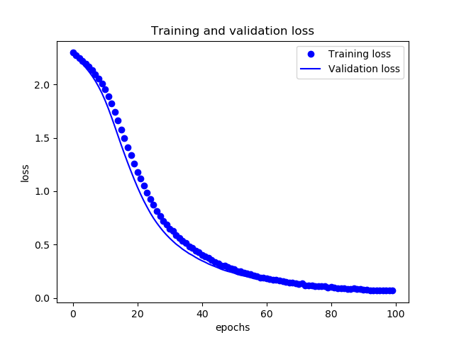

# Video-Classification
Final project for deep learning course.
Implemented using Keras. Dataset: UCF101.

Labels are sorted alphabetically, choose first ten classes to experiment.

1. Extract frames and split data as train/validation/test. Extract 30 frames evenly for 
each video through out the video. Split the trainset so that \#train : \#validation = 2 : 1.

2. Using pre-trained InceptionV3 model to generate data for the LSTM layers. So the data
produced has the shape (#vid * #frames_per_vid, 2048), reshape it into 
(#vid, #frames_per_vid, 2048), then feed it into the LSTM layers.

3. Using a stacked 5 LSTM layers model to make prediction on each video which is shaped as
(#frames_per_vid, 2048).

4. So the callback doesn't work right now, the accuracy during training and validation can
be like 99.% and 98.% or something, and the test accuracy is 92%.

5. Gonna try to do a optical flow fusion in the future, and see what's going on.

